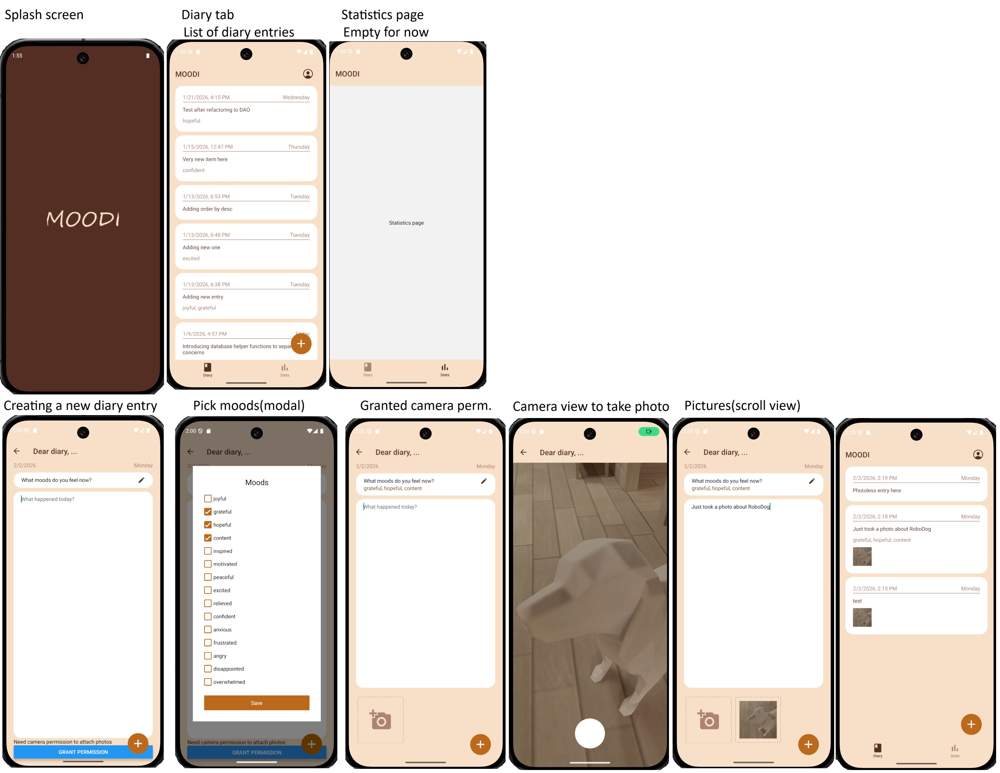

# Moodi :service_dog:

This React Native + Expo project is a diary application, where users can add diary entries and review them.

The goal of this application is to gather and store extra information about the diary entry, for example user's moods, geolocation, weather, photos, etc. Then, using these information, provide statistics as an overall reflection to the user.

The future goal is to analyze all of these extra information and help to improve the user's mental health.

## Features

### Current features

- Show list of diary entries
- Add new diary entries
  - saves current date and text of the entry
  - pick current moods from a predefined list
  - take photos with in-app camera



### Upcoming features and improvements

- Save geolocation and current weather info
- Add unit tests
- Detailed view of diary entries
- Attach existing photos from Gallery
- Use AI to analyze photos and find out moods automatically

## Get started

1. Install dependencies

   ```bash
   npm install
   ```

2. Start the app

   ```bash
   npx expo start
   ```

In the output, you'll find options to open the app in a

- [development build](https://docs.expo.dev/develop/development-builds/introduction/)
- [Android emulator](https://docs.expo.dev/workflow/android-studio-emulator/)
- [iOS simulator](https://docs.expo.dev/workflow/ios-simulator/)
- [Expo Go](https://expo.dev/go), a limited sandbox for trying out app development with Expo

### Development tips

- Trigger Android development build in EAS:

  ```bash
  eas build -p android -e development
  ```

- Use DevTools:
  - Press J in expo console
  - Ctrl + M in Android emulator
